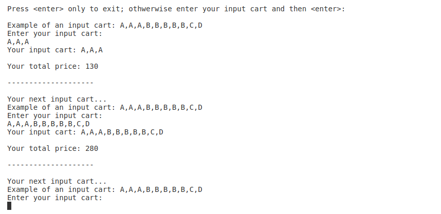

# PromotionEngine
A simple promotion engine for a checkout process

Prerequisites: .NET 6.0 SDK C# 10 and Docker (installed using Docker below).

## How the start of the project was created

Create new solution,

$ dotnet new sln

Create a class library project,

$ dotnet new classlib -o PromotionEngineLibrary

Add projects to solution,

$ dotnet sln add PromotionEngineLibrary/PromotionEngineLibrary.csproj

Create unit tests with NUnit,

$ dotnet new nunit -o PromotionEngineLibraryTest

The template "NUnit 3 Test Project" was created successfully.

Add project to solution,

$ dotnet sln add PromotionEngineLibraryTest/PromotionEngineLibraryTest.csproj

Add project reference in unit test project to PromotionEngineLibrary,

$ dotnet add PromotionEngineLibraryTest/PromotionEngineLibraryTest.csproj reference PromotionEngineLibrary/PromotionEngineLibrary.csproj

Build project,

$ dotnet build

Run unit tests,

$ dotnet test PromotionEngineLibraryTest/PromotionEngineLibraryTest.csproj

Create NuGet package Promotion.Engine.Library (same name as namespace) assuming you have set up an account on nuget.org with and API key. Go into the PromotionEngineLibrary folder and add to .csproj file inside existing `<PropertyGroup>` tag,

`
<PackageId>Promotion.Engine.Library</PackageId>
<Version>1.0.0</Version>
<Authors>your_name</Authors>
<Company>your_company</Company>
`

Then create the NuGet by running,

$ dotnet pack

Then upload the .nupkg file created in /bin/Debug/,

$ dotnet nuget push Promotion.Engine.Library.1.0.0.nupkg --api-key your_key --source https://api.nuget.org/v3/index.json

Add new NuGet pkg to your console app .csproj,

$ dotnet add package Promotion.Engine.Library

Which will download the package from https://www.nuget.org/packages/Promotion.Engine.Library/

Run the console app,

$ dotnet run --project PromotionEngineConsoleApp/PromotionEngineConsoleApp.csproj

## Deploy project into a Docker container

For Docker deploy place yourself one level above the folder of the this cloned project and run,

$ bash PromotionEngine/DockerDeploy/deploy.sh

## Output from running PromotionEngineConsoleApp

